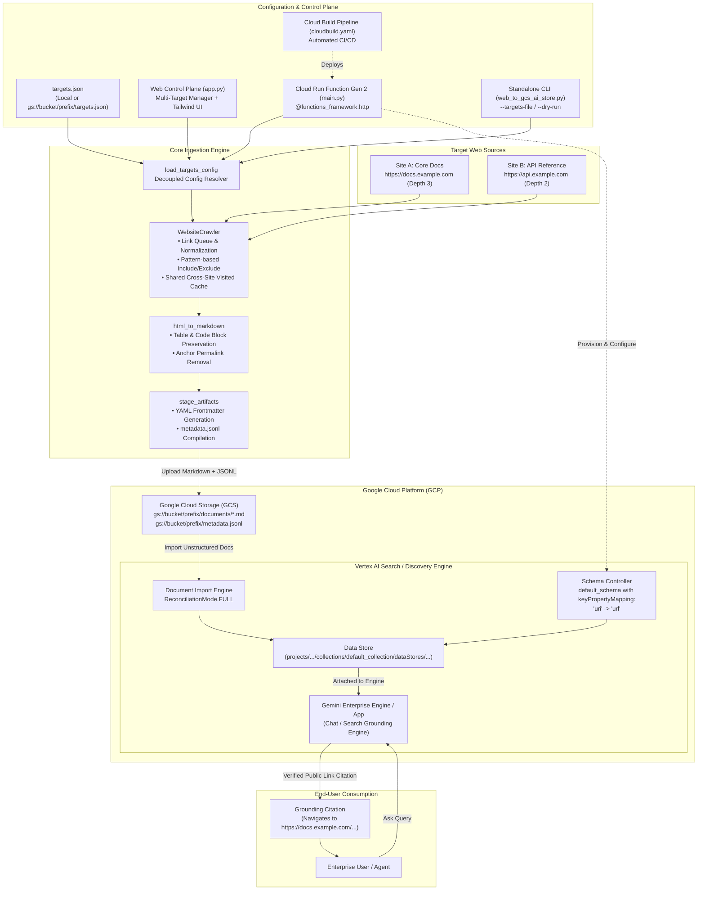

# System Architecture: Site-to-GCS & Gemini Enterprise Datastore Ingestor

This document outlines the technical architecture, design principles, data pipelines, and operational topologies of the **Site-to-GCS & Gemini Enterprise Datastore Ingestor** (`site-to-gcs-ingestor`). It serves as the definitive reference for engineering, extension, and deployment.

---

## 1. Executive Summary & Purpose

### 1.1 The Core Problem
When grounding **Gemini Enterprise Assistants** or **Vertex AI Search Engines** on enterprise public websites or documentation portals, standard ingestion patterns suffer from three systemic issues:
1. **The `gs://` Citation Leak**: When unstructured documents (e.g., Markdown, PDFs, HTML) are ingested directly from Google Cloud Storage, Vertex AI Search citations and assistant references default to internal Cloud Storage URIs (`gs://bucket-name/...`). For end users, these links are unclickable, require internal cloud IAM permissions, and break the assistant interaction model.
2. **Content Noise & Hallucinations**: Raw web scraping often pulls page boilerplate (navigation bars, menus, footers, tracking scripts, form widgets). This dilutes vector embeddings, wastes context window tokens, and introduces retrieval noise into generative responses.
3. **Index Drift & "Zombie" Documents**: Public websites change continuously. Without automated reconciliation, deleted or modified web pages leave orphaned records in the search index, resulting in outdated or invalid search answers.
4. **Rigid Target Management**: Organizations maintain multiple documentation domains, API specifications, and knowledge bases—each requiring different traversal depths and page quotas. Requiring code changes or redeployments just to add a URL or change depth creates operational friction.

### 1.2 The Solution
The **Site-to-GCS & Gemini Enterprise Datastore Ingestor** provides an end-to-end automated pipeline that:
- Supports declarative **multi-target website scanning** (`targets.json`) with independent crawl depths, page limits, and URL pattern filters.
- Supports a **decoupled configuration pattern** (`TARGETS_CONFIG_URI`), allowing administrators to adjust target sites and depths via Cloud Storage without redeploying the Cloud Run Function.
- Recursively crawls target public websites with polite rate-limiting, noise-tag filtering, and character encoding correction.
- Extracts clean semantic body content and converts it into AI-optimized Markdown (retaining tables, code blocks, lists, and hierarchy).
- Injects YAML metadata frontmatter and top-level web source banners into every document.
- Stages and uploads the corpus and a Vertex AI Search compliant `metadata.jsonl` catalog to Google Cloud Storage (GCS).
- Automatically provisions or updates the Discovery Engine Data Store with a customized JSON Schema enforcing **`keyPropertyMapping: {"uri": "url"}`**, guaranteeing that **all citations and assistant search cards route directly to the live public web URL**.
- Executes document ingestion with **`ReconciliationMode.FULL`**, automatically purging obsolete/deleted pages on scheduled runs.
- Offers dual deployment pathways: **Manual `gcloud` execution** and automated **GitOps CI/CD via Cloud Build (`cloudbuild.yaml`)**.

---

## 2. High-Level Architecture



---

## 3. Core Technical Mechanism: Guaranteed Public Web Citations

The linchpin of this architecture is how Vertex AI Search (Discovery Engine) handles the **Linked Unstructured Documents** specification.

### 3.1 Unstructured Document Metadata Specification
For each crawled page, the engine generates an entry in `metadata.jsonl` structured as follows:

```json
{
  "id": "tutorial_introduction_3a8b4f10cd",
  "structData": {
    "title": "An Informal Introduction to Python",
    "url": "https://docs.python.org/3/tutorial/introduction.html",
    "description": "Python is an easy to learn, powerful programming language...",
    "author": "Python Software Foundation",
    "target_name": "python-tutorial",
    "crawled_at": "2026-09-14T17:00:00+00:00"
  },
  "content": {
    "mimeType": "text/markdown",
    "uri": "gs://my-ai-knowledge-bucket/website_datastore/documents/tutorial_introduction_3a8b4f10cd.md"
  }
}
```

- **`content.uri`**: Supplies the raw Markdown document in Cloud Storage. Discovery Engine uses this blob for textual chunking, tokenization, semantic embedding, and retrieval augmented generation (RAG).
- **`structData.url`**: Stores the canonical live web URL of the original source.

### 3.2 Discovery Engine Schema Mapping
Without schema customization, Discovery Engine defaults to returning `content.uri` (`gs://...`) as the document link. To override this behavior, the ingestor provisions or updates the Data Store schema (`default_schema`) using `google.cloud.discoveryengine_v1.SchemaServiceClient`:

```json
{
  "$schema": "https://json-schema.org/draft/2020-12/schema",
  "type": "object",
  "properties": {
    "title": {
      "type": "string",
      "keyPropertyMapping": "title"
    },
    "url": {
      "type": "string",
      "keyPropertyMapping": "uri"
    },
    "description": {
      "type": "string",
      "keyPropertyMapping": "description"
    },
    "author": {
      "type": "string"
    },
    "target_name": {
      "type": "string"
    },
    "crawled_at": {
      "type": "string"
    }
  }
}
```

> [!IMPORTANT]
> By declaring `"keyPropertyMapping": "uri"` on the `url` property, Discovery Engine is instructed to substitute `structData.url` as the primary document URI. When Gemini Enterprise generates grounding citations, it displays and links directly to `https://docs.python.org/3/...` instead of `gs://my-ai-knowledge-bucket/...`.

---

## 4. Multi-Target Management Architecture (`targets.json`)

To manage multiple documentation sources with fine-grained depth control and pattern exclusions, the system introduces the declarative **Target Manifest**.

### 4.1 Schema Specification
```json
{
  "version": "1.0",
  "default_delay": 0.2,
  "targets": [
    {
      "name": "developer-docs",
      "url": "https://docs.example.com/guide/",
      "max_depth": 3,
      "max_pages": 150,
      "include_patterns": ["*/guide/*", "*/concepts/*"],
      "exclude_patterns": ["*/archive/*", "*/deprecated/*"]
    },
    {
      "name": "api-reference",
      "url": "https://api.example.com/v2/",
      "max_depth": 2,
      "max_pages": 50,
      "exclude_patterns": ["*/changelog/*"]
    }
  ]
}
```

### 4.2 Configuration Resolution Hierarchy
The `load_targets_config()` resolver evaluates configuration inputs in the following priority order:
1. **Explicit Payload Targets**: If `config["targets"]` is present in the incoming HTTP JSON payload, it takes immediate precedence (used by Web UI and direct API triggers).
2. **Decoupled GCS Manifest**: If `TARGETS_CONFIG_URI` is set (e.g., `gs://<bucket>/<prefix>/targets.json`), the Cloud Run Function fetches the JSON file from Cloud Storage on every invocation.
3. **Local File Manifest**: If `TARGETS_CONFIG_URI` points to a local file path (e.g., `targets.json`), the file is read locally (used by CLI).
4. **Legacy Single Target**: If only `url` (or `BASE_URL`) is supplied, it generates a single default target, maintaining 100% backward compatibility.

---

## 5. Deployment Topologies: Manual vs. Cloud Build CI/CD

### 5.1 Automated GitOps CI/CD (`cloudbuild.yaml`)
Platform teams can execute automated builds and deployments via Google Cloud Build.
The pipeline:
1. Validates Python dependencies and runs syntax compilation (`main.py`, `app.py`, `web_to_gcs_ai_store.py`).
2. Deploys the Cloud Run Function Gen 2 with `TARGETS_CONFIG_URI` and GCP environment variables.
3. Idempotently provisions or updates the Cloud Scheduler cron job with an authenticated OIDC service account.

```bash
gcloud builds submit --config=cloudbuild.yaml \
  --substitutions=_GCP_PROJECT="my-gcp-project",_GCS_BUCKET="my-ai-knowledge-bucket",_DATA_STORE_ID="web-docs-store"
```

### 5.2 Manual Deployment (`gcloud` CLI)
```bash
gcloud functions deploy site-datastore-ingestor \
  --gen2 \
  --runtime=python311 \
  --region=us-central1 \
  --source=. \
  --entry-point=index_website_handler \
  --memory=2Gi \
  --timeout=1800s \
  --set-env-vars=GCP_PROJECT="my-gcp-project",LOCATION="global",GCS_BUCKET="my-ai-knowledge-bucket",GCS_PREFIX="website_datastore",DATA_STORE_ID="web-docs-store",ENGINE_ID="gemini-assistant-app",TARGETS_CONFIG_URI="gs://my-ai-knowledge-bucket/website_datastore/targets.json"
```

---

## 6. Component Reference

| Component | Responsibility | Key Features |
| :--- | :--- | :--- |
| `WebsiteCrawler` | Crawling & Content Extraction | Respects `max_depth`, `max_pages`, `include_patterns`, `exclude_patterns`. Employs shared visited set across targets to prevent re-crawls. Handles encoding auto-repair (`apparent_encoding`). |
| `html_to_markdown` | DOM to AI Markdown | Recursive node conversion. Prunes noise tags (`<nav>`, `<footer>`, `<script>`). Formats Markdown pipe tables and fenced code blocks. Cleans permalink symbols (`¶`, `#`). |
| `stage_artifacts` | Staging & Schema Compilation | Generates `.md` files with YAML frontmatter and `**Source URL:**` link. Assembles `metadata.jsonl` matching Vertex AI Search Linked Unstructured Documents specification. |
| `upload_to_gcs` | Cloud Storage Synchronization | Walks staging directory, uploads blobs with correct MIME types (`text/markdown`, `application/json`). |
| `ensure_datastore_and_schema` | Discovery Engine Controller | Idempotently creates Data Store and updates schema with `keyPropertyMapping: {"uri": "url"}`. |
| `trigger_datastore_import` | Batch Reconciliation Import | Executes `import_documents` with `ReconciliationMode.FULL` to purge deleted pages and refresh modified pages. |
| `IngestionWorker` | Web UI Asynchronous Orchestrator | Daemon thread managing multi-target execution, logging events, updating progress bars, and caching document previews. |

---

## 7. Security, IAM & Governance

| Resource | Required Role / Permission | Purpose |
| :--- | :--- | :--- |
| **Cloud Storage** | `roles/storage.objectAdmin` | Write `.md` documents, `metadata.jsonl`, and read `targets.json`. |
| **Discovery Engine** | `roles/discoveryengine.admin` or `roles/discoveryengine.editor` | Create Data Store, update schema mapping, and execute document imports. |
| **Cloud Run Function** | `roles/run.invoker` | Granted to Cloud Scheduler's service account to invoke the HTTP trigger. |
| **Cloud Build** | `roles/cloudbuild.builds.editor` | Granted to CI/CD triggers to submit builds and deploy functions. |
